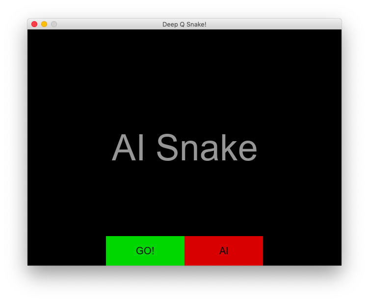

# Playing snake game with Pytorch Deep Q-Learning by Charlie D
My intention to build this project is to practice deep q learning and pygame. The main goal of this project is to develop an AI bot which can learn to play the popular snake game. In order to compare the learning result with human performance, this project consists of two modes, manual and ai mode. More instruction can be found below. 

Along the road of my research, I realized there are not a lot pytorch deep q sanke codes exist and some of them are rather complicated or require a long time to train. So I decided to implement a pytorch model, which can rapidly converge.

I adopted the idea of network input data and some training technics from [here](https://towardsdatascience.com/how-to-teach-an-ai-to-play-games-deep-reinforcement-learning-28f9b920440a). According to the article, I used 11 boolean variables as the input. I rebuilt the model by using just 3 (input, hidden, output) fully connected layers. After some refinements, the model can converge after about 50 games.


### Install
To run this project, you need the following packages
1. Pytorch
2. Pygame
3. numpy
4. matplotlib
5. other packages - you will find out by running the code :P

### Command Base Usage
1. If you want to run manual play mode:
```python
python snake.py
```
2. To train the model, go to Agent.py and uncomment line 299, then do:
```python
python Agent.py
# You can tune the paramenters in Agent.py and network.py.
# You can also change the setting of the game wrapper in snake_ai.py. I set *self.FPS=40* to speed up the training.
```
3. To play game based on the pre-trained model, go to Agent.py and uncomment line 300, then do:
```python
python Agent.py
# This will call the model weight you save in './model' folder
```

### UI Usage
To start:
```python
python run.py
```
1. Choose your option on game intro page.


2. If you chose manual mode, you will see a white snake. Use w,a,s,d or up, down, left, right keys to control.

When your snake die, you can restart the game.


3. If you chose AI mode, you will have to choose to train bot or play bot


4. If you chose *train*, game will start to train and save the result in *./model*. You can press `esc` to quit the game

Training result:


5. If you chose *play*, game will pick the weight saves in *./model* and play the game. Press `esc` to quit.


### TO-DO
---
Might implement a restart function in the future.
